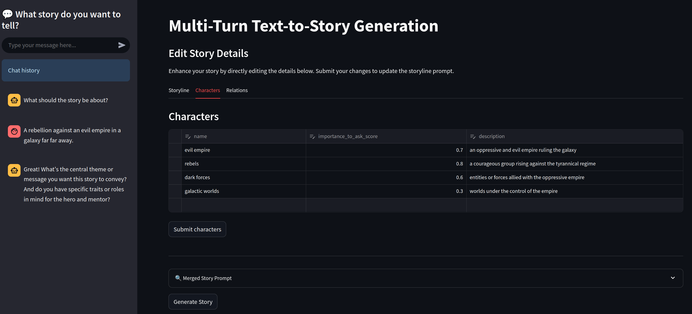

## LLM-supported Story Creation

A Streamlit-based application for multi-turn text-to-story generation.
Adapting an approach described for image generation in [1] and encouraging structure on stories as described in [2].

Instead of an agentic loop, streamlit's ui is used for multi-turn interaction between user and LLM.



### Setup Instructions

1. **Clone the Repository**:
   ```bash
   git clone <repository-url>
   cd <repository-directory>
   ```

2. **Environment Variables**:
   Create `.env` file from `.env.template` and fill in environment variables.

3. **Run with Docker**:
   Build and start the application using Docker Compose:
   ```bash
   docker-compose up --build
   ```

### Usage
- Access the app at `http://localhost:8501`.
- Answer questions in the sidebar, or edit structured data on character descriptions, relationships and story structure.

### References
1. [Proactive Agents for Multi-Turn Text-to-Image Generation Under Uncertainty](https://arxiv.org/abs/2412.06771).
2. [A Practical Guide to Joseph Cambell’s The Hero with a Thousand Faces](https://www.google.com/url?sa=t&source=web&rct=j&opi=89978449&url=https://www.thinking-differently.com/creativity/wp-content/uploads/2014/01/The-Heros-Journey.pdf&ved=2ahUKEwj3gLb_yLyOAxWKQvEDHe7NMHoQFnoECBYQAQ&usg=AOvVaw1DPclYZVjXzPz0jEQMVhzW)